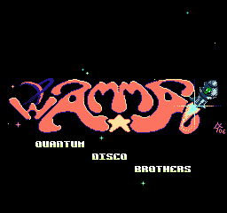
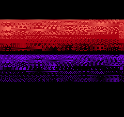
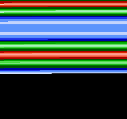
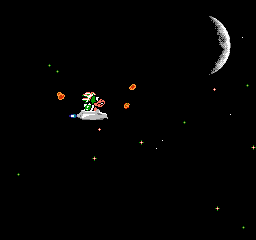
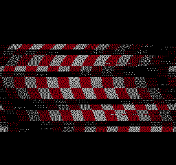
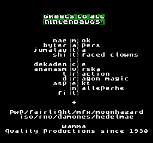

# nes-quantum-disassembly

An unofficial disassembly of the Nintendo Entertainment System (NES) demo *Quantum Disco Brothers* by wAMMA.

Notes:
* The CHR ROM (graphics data) is not included.
* This disassembly is at an early stage.
* I have not been involved with wAMMA or in the making of this demo.
* This project had an incorrect license for a short time by mistake.

## How to get the original files
* Download the original *Quantum Disco Brothers* file from e.g. [the scene.org file archive](http://files.scene.org/view/parties/2006/stream06/demo/quantum_disco_brothers_by_wamma.zip).
* If the file is compressed, extract it to get an iNES ROM file (`.nes`).
* The `.nes` file should be 65,552 bytes and have the MD5 hash `2c932e9e8ae7859517905e2539565a89`.
* Rename the `.nes` file to `quantum-original.nes`.
* Extract the PRG ROM data to `prg-original.bin` and the CHR ROM data to `chr.bin` from the `.nes` file. Use my [ines-split](http://github.com/qalle2/ines-split) or a general-purpose tool like a hex editor (the `.nes` file consists of a 16-byte iNES header, then the PRG ROM data and finally the CHR ROM data.)

## How to assemble
* Install the asm6f assembler:
  * [GitHub page](https://github.com/freem/asm6f)
  * [64-bit Windows binary](http://qallee.net/misc/asm6f-win64.zip) (compiled by me)
* You have two options:
  * Option 1: run `assemble.bat` (only works on Windows; also compares the assembled files to the originals).
  * Option 2: assemble the source manually:
    * `asm6f prg.asm prg.bin`
    * `prg.bin` should be identical to `prg-original.bin`
    * `asm6f quantum.asm "quantum_(e).nes"` (`(e)` in the output filename causes FCEUX to correctly start the ROM in PAL mode)
    * `quantum_(e).nes` should be identical to `quantum-original.nes`

## The type of the iNES ROM file (from the header)
* mapper: CNROM (iNES mapper number 3)
* PRG ROM: 32 KiB (1 &times; 32 KiB)
* CHR ROM: 32 KiB (4 &times; 8 KiB)
* name table mirroring: horizontal
* no trainer
* no save RAM

## The parts of the demo
* Screenshots from FCEUX in PAL mode.
* Frame numbers: FCEUX's Frame Display in PAL mode.
* The internal part numbers are at RAM address `0x0001`.


1st part (internally part 0, starts at frame ~6): "GREETINGS! WE COME FROM..."; uses CHR bank 0


2nd part (internally part 2, starts at frame 1156): "wAMMA - QUANTUM DISCO BROTHERS"; uses CHR bank 0


3rd part (internally part 11, starts at frame 1923): red&purple gradients; uses CHR bank 1


4th part (internally part 1, starts at frame 2690): horizontal color bars; uses CHR bank 1


5th part (internally part 4, starts at frame 3458): a woman; uses CHR bank 3


6th part (internally part 5, starts at frame 4481): "IT IS FRIDAY..."; uses CHR bank 0


7th part (internally part 7, starts at frame 6362): Coca Cola cans; uses CHR bank 2


8th part (internally part 6, starts at frame 7304): Bowser's spaceship; uses CHR bank 2


9th part (internally part 3, starts at frame 8071): credits; uses CHR bank 1


10th part (internally part 10, starts at frame 9692): a checkered wavy animation; uses CHR bank 1


11th part (internally part 12, starts at frame 10380): "GREETS TO ALL NINTENDAWGS"; uses CHR bank 2


12th part (internally part 13, starts at frame 11298): "GAME OVER - CONTINUE?"; uses CHR bank 2


13th part (internally part 9, starts at frame 14018): more horizontal color bars; uses CHR bank 2

The demo should probably end at this point, as on [this YouTube video](https://www.youtube.com/watch?v=hhoa_K75BKI). However, on FCEUX, it starts to glitch from frame ~17603 on. I omitted the glitchy part from the Code/Data Logger file.

## FCEUX Code/Data Log - PRG ROM
I used my [cdl-summary](http://github.com/qalle2/cdl-summary) with the following arguments:

`python cdl_summary.py --prg-size 32 --part p --origin 32 --bank-size 32 quantum.cdl`

CPU address range, block length, description:
```
$8000-$8033 (  52): unaccessed
$8034-$8156 ( 291): code
$8157-$8158 (   2): unaccessed
$8159-$815c (   4): code
$815d-$815e (   2): unaccessed
$815f-$81ca ( 108): code
$81cb-$81cc (   2): unaccessed
$81cd-$823a ( 110): code
$823b-$8247 (  13): unaccessed
$8248-$8269 (  34): code
$826a-$8276 (  13): unaccessed
$8277-$8286 (  16): code
$8287-$8288 (   2): unaccessed
$8289-$828e (   6): code
$828f-$82d0 (  66): unaccessed
$82d1-$838d ( 189): code
$838e-$83b2 (  37): unaccessed
$83b3-$8413 (  97): code
$8414-$8416 (   3): unaccessed
$8417-$8432 (  28): code
$8433-$8435 (   3): unaccessed
$8436-$8477 (  66): code
$8478-$847a (   3): unaccessed
$847b-$8494 (  26): code
$8495       (   1): unaccessed
$8496-$84f7 (  98): code
$84f8-$850c (  21): unaccessed
$850d-$854d (  65): code
$854e-$855a (  13): unaccessed
$855b-$855d (   3): code
$855e-$85b0 (  83): unaccessed
$85b1-$862c ( 124): code
$862d-$8651 (  37): unaccessed
$8652-$8680 (  47): code
$8681-$86a1 (  33): unaccessed
$86a2-$8797 ( 246): code
$8798-$8799 (   2): unaccessed
$879a-$8905 ( 364): code
$8906-$8920 (  27): unaccessed
$8921-$8924 (   4): code
$8925-$892f (  11): unaccessed
$8930-$8932 (   3): code
$8933       (   1): unaccessed
$8934-$8938 (   5): code
$8939-$893a (   2): unaccessed
$893b-$8949 (  15): code

$894a-$895a (  17): unaccessed
$895b-$896a (  16): data
$896b       (   1): unaccessed
$896c-$8973 (   8): data
$8974       (   1): unaccessed
$8975-$897b (   7): data
$897c       (   1): unaccessed
$897d-$8985 (   9): data
$8986       (   1): unaccessed
$8987       (   1): data
$8988-$8996 (  15): unaccessed
$8997       (   1): data
$8998-$89a6 (  15): unaccessed
$89a7       (   1): data
$89a8-$89b6 (  15): unaccessed
$89b7       (   1): data
$89b8-$89c6 (  15): unaccessed
$89c7       (   1): data
$89c8-$89d6 (  15): unaccessed
$89d7       (   1): data
$89d8-$89e6 (  15): unaccessed
$89e7       (   1): data
$89e8-$89f6 (  15): unaccessed
$89f7       (   1): data
$89f8-$8a06 (  15): unaccessed
$8a07       (   1): data
$8a08-$8a16 (  15): unaccessed
$8a17       (   1): data
$8a18       (   1): unaccessed
$8a19       (   1): data
$8a1a-$8a26 (  13): unaccessed
$8a27       (   1): data
$8a28-$8a36 (  15): unaccessed
$8a37       (   1): data
$8a38-$8a46 (  15): unaccessed
$8a47       (   1): data
$8a48-$8a56 (  15): unaccessed
$8a57       (   1): data
$8a58-$8a65 (  14): unaccessed
$8a66-$8a67 (   2): data
$8a68-$8a76 (  15): unaccessed
$8a77       (   1): data
$8a78-$8a88 (  17): unaccessed
$8a89       (   1): data
$8a8a-$8a8b (   2): unaccessed
$8a8c-$8a8d (   2): data
$8a8e-$8a8f (   2): unaccessed
$8a90-$8a92 (   3): data
$8a93       (   1): unaccessed
$8a94-$8a97 (   4): data
$8a98       (   1): unaccessed
$8a99-$8aa5 (  13): data
$8aa6       (   1): unaccessed
$8aa7-$8aa8 (   2): data
$8aa9       (   1): unaccessed
$8aaa       (   1): data
$8aab       (   1): unaccessed
$8aac-$8ab6 (  11): data
$8ab7       (   1): unaccessed
$8ab8-$8abd (   6): data
$8abe       (   1): unaccessed
$8abf-$8ac2 (   4): data
$8ac3       (   1): unaccessed
$8ac4       (   1): data
$8ac5-$8ac6 (   2): unaccessed
$8ac7       (   1): data
$8ac8-$8ae8 (  33): unaccessed
$8ae9       (   1): data
$8aea-$8aeb (   2): unaccessed
$8aec-$8aed (   2): data
$8aee-$8aef (   2): unaccessed
$8af0-$8af2 (   3): data
$8af3       (   1): unaccessed
$8af4-$8af7 (   4): data
$8af8       (   1): unaccessed
$8af9-$8b05 (  13): data
$8b06       (   1): unaccessed
$8b07-$8b08 (   2): data
$8b09       (   1): unaccessed
$8b0a       (   1): data
$8b0b       (   1): unaccessed
$8b0c-$8b16 (  11): data
$8b17       (   1): unaccessed
$8b18-$8b1d (   6): data
$8b1e       (   1): unaccessed
$8b1f-$8b22 (   4): data
$8b23       (   1): unaccessed
$8b24       (   1): data
$8b25-$8b26 (   2): unaccessed
$8b27       (   1): data
$8b28-$8b45 (  30): unaccessed
$8b46-$8b47 (   2): data
$8b48-$8b6a (  35): unaccessed
$8b6b-$8b6c (   2): data (indirectly accessed)
$8b6d-$8b6e (   2): unaccessed
$8b6f-$8b74 (   6): data (indirectly accessed)
$8b75-$8b77 (   3): unaccessed
$8b78-$8baf (  56): data (indirectly accessed)
$8bb0-$8bb7 (   8): unaccessed
$8bb8-$8be7 (  48): data (indirectly accessed)
$8be8-$8bf7 (  16): unaccessed
$8bf8-$8bfa (   3): data (indirectly accessed)
$8bfb       (   1): unaccessed
$8bfc-$8bfe (   3): data (indirectly accessed)
$8bff       (   1): unaccessed
$8c00-$8c02 (   3): data (indirectly accessed)
$8c03       (   1): unaccessed
$8c04-$8c06 (   3): data (indirectly accessed)
$8c07       (   1): unaccessed
$8c08-$8c0a (   3): data (indirectly accessed)
$8c0b       (   1): unaccessed
$8c0c-$8c0e (   3): data (indirectly accessed)
$8c0f       (   1): unaccessed
$8c10-$8c12 (   3): data (indirectly accessed)
$8c13       (   1): unaccessed
$8c14-$8c16 (   3): data (indirectly accessed)
$8c17       (   1): unaccessed
$8c18-$8c1a (   3): data (indirectly accessed)
$8c1b       (   1): unaccessed
$8c1c-$8c1e (   3): data (indirectly accessed)
$8c1f       (   1): unaccessed
$8c20-$8c22 (   3): data (indirectly accessed)
$8c23       (   1): unaccessed
$8c24-$8c26 (   3): data (indirectly accessed)
$8c27       (   1): unaccessed
$8c28-$8c2a (   3): data (indirectly accessed)
$8c2b       (   1): unaccessed
$8c2c-$8c2e (   3): data (indirectly accessed)
$8c2f       (   1): unaccessed
$8c30-$8c32 (   3): data (indirectly accessed)
$8c33       (   1): unaccessed
$8c34-$8c36 (   3): data (indirectly accessed)
$8c37       (   1): unaccessed
$8c38-$8c3a (   3): data (indirectly accessed)
$8c3b       (   1): unaccessed
$8c3c-$8c3e (   3): data (indirectly accessed)
$8c3f       (   1): unaccessed
$8c40-$8c42 (   3): data (indirectly accessed)
$8c43       (   1): unaccessed
$8c44-$8c46 (   3): data (indirectly accessed)
$8c47       (   1): unaccessed
$8c48-$8c4a (   3): data (indirectly accessed)
$8c4b       (   1): unaccessed
$8c4c-$8c4e (   3): data (indirectly accessed)
$8c4f       (   1): unaccessed
$8c50-$8c52 (   3): data (indirectly accessed)
$8c53       (   1): unaccessed
$8c54-$8c56 (   3): data (indirectly accessed)
$8c57       (   1): unaccessed
$8c58-$8c5a (   3): data (indirectly accessed)
$8c5b       (   1): unaccessed
$8c5c-$8c5e (   3): data (indirectly accessed)
$8c5f       (   1): unaccessed
$8c60-$8c62 (   3): data (indirectly accessed)
$8c63       (   1): unaccessed
$8c64-$8c66 (   3): data (indirectly accessed)
$8c67       (   1): unaccessed
$8c68-$8c6a (   3): data (indirectly accessed)
$8c6b       (   1): unaccessed
$8c6c-$8c6e (   3): data (indirectly accessed)
$8c6f       (   1): unaccessed
$8c70-$8c72 (   3): data (indirectly accessed)
$8c73       (   1): unaccessed
$8c74-$8c76 (   3): data (indirectly accessed)
$8c77       (   1): unaccessed
$8c78-$8c7a (   3): data (indirectly accessed)
$8c7b       (   1): unaccessed
$8c7c-$8c7e (   3): data (indirectly accessed)
$8c7f       (   1): unaccessed
$8c80-$8c82 (   3): data (indirectly accessed)
$8c83       (   1): unaccessed
$8c84-$8c86 (   3): data (indirectly accessed)
$8c87       (   1): unaccessed
$8c88-$8c8a (   3): data (indirectly accessed)
$8c8b       (   1): unaccessed
$8c8c-$8c8e (   3): data (indirectly accessed)
$8c8f       (   1): unaccessed
$8c90-$8c92 (   3): data (indirectly accessed)
$8c93       (   1): unaccessed
$8c94-$8c96 (   3): data (indirectly accessed)
$8c97       (   1): unaccessed
$8c98-$8c9a (   3): data (indirectly accessed)
$8c9b       (   1): unaccessed
$8c9c-$8c9e (   3): data (indirectly accessed)
$8c9f       (   1): unaccessed
$8ca0-$8ca2 (   3): data (indirectly accessed)
$8ca3       (   1): unaccessed
$8ca4-$8ca6 (   3): data (indirectly accessed)
$8ca7       (   1): unaccessed
$8ca8-$8caa (   3): data (indirectly accessed)
$8cab       (   1): unaccessed
$8cac-$8cae (   3): data (indirectly accessed)
$8caf       (   1): unaccessed
$8cb0-$8cb2 (   3): data (indirectly accessed)
$8cb3       (   1): unaccessed
$8cb4-$8cb6 (   3): data (indirectly accessed)
$8cb7       (   1): unaccessed
$8cb8-$8cba (   3): data (indirectly accessed)
$8cbb       (   1): unaccessed
$8cbc-$8cbe (   3): data (indirectly accessed)
$8cbf       (   1): unaccessed
$8cc0-$8cc2 (   3): data (indirectly accessed)
$8cc3       (   1): unaccessed
$8cc4-$8cc6 (   3): data (indirectly accessed)
$8cc7       (   1): unaccessed
$8cc8-$8cca (   3): data (indirectly accessed)
$8ccb       (   1): unaccessed
$8ccc-$8cce (   3): data (indirectly accessed)
$8ccf       (   1): unaccessed
$8cd0-$8cd2 (   3): data (indirectly accessed)
$8cd3       (   1): unaccessed
$8cd4-$8cd6 (   3): data (indirectly accessed)
$8cd7       (   1): unaccessed
$8cd8-$8cda (   3): data (indirectly accessed)
$8cdb       (   1): unaccessed
$8cdc-$8cde (   3): data (indirectly accessed)
$8cdf       (   1): unaccessed
$8ce0-$8ce2 (   3): data (indirectly accessed)
$8ce3-$8ce7 (   5): unaccessed
$8ce8-$8ce9 (   2): data (indirectly accessed)
$8cea-$8ceb (   2): unaccessed
$8cec-$8d23 (  56): data (indirectly accessed)
$8d24-$8d2b (   8): unaccessed
$8d2c-$8d33 (   8): data (indirectly accessed)
$8d34-$8d35 (   2): unaccessed
$8d36-$8d71 (  60): data (indirectly accessed)
$8d72-$8d73 (   2): unaccessed
$8d74-$8dbf (  76): data (indirectly accessed)
$8dc0-$8e12 (  83): unaccessed
$8e13-$a08c (4730): data (indirectly accessed)
$a08d-$bfff (8051): unaccessed

$c000-$c0a7 ( 168): code

$c0a8-$c0b5 (  14): data
$c0b6-$c0b7 (   2): unaccessed
$c0b8-$c127 ( 112): data (indirectly accessed)
$c128-$c137 (  16): unaccessed
$c138-$c24d ( 278): data
$c24e-$c253 (   6): unaccessed
$c254-$c273 (  32): data
$c274-$c27f (  12): unaccessed
$c280-$d220 (4001): data (PCM audio)
$d221-$d224 (   4): unaccessed
$d225-$d50d ( 745): data
$d50e-$d50f (   2): unaccessed
$d510-$d514 (   5): data
$d515       (   1): unaccessed
$d516-$d519 (   4): data
$d51a       (   1): unaccessed
$d51b       (   1): data
$d51c-$d51e (   3): unaccessed
$d51f       (   1): data
$d520-$d521 (   2): unaccessed
$d522-$d523 (   2): data
$d524-$d52f (  12): unaccessed
$d530-$da3c (1293): data
$da3d-$da84 (  72): unaccessed
$da85-$dae9 ( 101): data
$daea-$db1a (  49): unaccessed
$db1b-$db27 (  13): data
$db28-$db29 (   2): unaccessed
$db2a-$dba1 ( 120): data
$dba2-$dbb0 (  15): unaccessed
$dbb1-$dbb4 (   4): data
$dbb5-$dbce (  26): unaccessed
$dbcf-$dc1b (  77): data
$dc1c-$dc20 (   5): unaccessed
$dc21-$dc2b (  11): data
$dc2c-$dc30 (   5): unaccessed
$dc31-$dc3b (  11): data
$dc3c-$dc40 (   5): unaccessed
$dc41-$dc4b (  11): data
$dc4c-$dc51 (   6): unaccessed
$dc52-$dc91 (  64): data
$dc92-$dc95 (   4): unaccessed

$dc96-$dca9 (  20): code
$dcaa-$dcce (  37): unaccessed
$dccf-$dd21 (  83): code
$dd22-$dd4e (  45): unaccessed
$dd4f-$df9f ( 593): code
$dfa0       (   1): code, data
$dfa1-$e012 ( 114): code
$e013-$e015 (   3): unaccessed
$e016-$e0d2 ( 189): code
$e0d3-$e1a4 ( 210): unaccessed
$e1a5-$e25c ( 184): code
$e25d       (   1): code, data
$e25e-$e471 ( 532): code
$e472       (   1): code, data
$e473-$e5d6 ( 356): code
$e5d7       (   1): code, data
$e5d8-$ea7e (1191): code
$ea7f       (   1): code, data
$ea80-$ec46 ( 455): code
$ec47       (   1): code, data
$ec48-$ec98 (  81): code
$ec99-$eefa ( 610): unaccessed
$eefb-$f08f ( 405): code
$f090       (   1): code, data
$f091-$f110 ( 128): code
$f111-$f115 (   5): unaccessed
$f116-$f28b ( 374): code
$f28c       (   1): code, data
$f28d-$f44a ( 446): code
$f44b       (   1): code, data
$f44c-$f4f8 ( 173): code
$f4f9-$f503 (  11): unaccessed
$f504-$f67f ( 380): code
$f680       (   1): code, data
$f681-$f7cf ( 335): code
$f7d0-$f7fc (  45): unaccessed
$f7fd-$f97f ( 387): code
$f980-$f982 (   3): unaccessed
$f983-$f9b2 (  48): code
$f9b3-$f9b6 (   4): unaccessed
$f9b7-$fb34 ( 382): code
$fb35-$fb3c (   8): unaccessed
$fb3d-$fc25 ( 233): code
$fc26-$fff9 ( 980): unaccessed

$fffa-$fffd (   4): data (NMI&amp;reset vectors)
$fffe-$ffff (   2): unaccessed (IRQ vector)
```

## FCEUX Code/Data Log - CHR ROM
I used my [cdl-summary](http://github.com/qalle2/cdl-summary) with the following arguments:

`python cdl_summary.py --prg-size 32 --part c --origin 0 --bank-size 8 quantum.cdl`

No CHR data was read programmatically via `$2007`.

Tiles rendered (completely or partially):
* bank 0 - first half: `$00`, `$0a-$19`, `$1b-$20`, `$22`, `$24-$25`, `$2a-$2f`, `$37-$3f`, `$48-$4f`, `$58-$69`, `$6e-$79`, `$7e-$87`, `$8a-$97`, `$9a-$a1`, `$a4-$a5`, `$ac-$b1`, `$b4-$b5`, `$bc-$bf`, `$c2-$c6`, `$c9-$cf`, `$d2-$e5`, `$ea-$ff`
* bank 0 - second half: `$00-$ff`
* bank 1 - first half: `$00-$17`, `$19-$1a`, `$1c-$2f`, `$31-$84`, `$c4-$d1`, `$d3-$d4`, `$d6-$da`, `$dc`, `$de-$e4`, `$e6`, `$e8-$e9`, `$eb`, `$ed`, `$ef-$f0`, `$f2-$ff`
* bank 1 - second half: `$00-$b3`, `$c0-$cf`, `$e0-$f7`
* bank 2 - first half: `$00`, `$09-$0f`, `$19-$1e`, `$29-$2f`, `$3e-$43`, `$50-$53`, `$60-$ff`
* bank 2 - second half: `$00-$4e`, `$50`, `$7a-$7e`, `$80-$ff`
* bank 3 - first half: `$00-$ff`
* bank 3 - second half: `$00-$d9`, `$df-$e4`, `$ef-$ff`

## Unused graphics
The actual colors are unknown.


A cat in the first half of CHR bank 0. Colored by me.


Three ninja animation frames in the first half of CHR bank 2. Colored by me.


A small crescent moon in the first half of CHR bank 2. Here, colored the same as the big crescent moon used in the 8th part of the demo.


Big asteroids (fireballs?) in the first half of CHR bank 2. Here, colored the same as the small asteroids/fireballs used in the 8th part of the demo.


The eyes of a ninja in the second half of CHR bank 2. Colored by me.

## CPU RAM map
* `000`-`004`: ??
* `005`-`085`: unaccessed (except for the initial cleanup)
* `086`-`0ac`: ??
* `0ad`-`0c7`: unaccessed (except for the initial cleanup)
* `0c8`-`0ef`: ??
* `0f0`-`0fe`: unaccessed (except for the initial cleanup)
* `0ff`-`1ab`: ??
* `1ac`-`1eb`: unaccessed (except for the initial cleanup)
* `1ec`-`1ff`: probably stack
* `200`-`2ff`: unaccessed (except for the initial cleanup)
* `300`-`3ff`: ??
* `400`-`4ff`: unaccessed (except for the initial cleanup)
* `500`-`5ff`: used for OAM DMA
* `600`-`67f`: ??
* `680`-`7bf`: unaccessed (except for the initial cleanup)
* `7c0`-`7df`: a copy of current palette?
* `7e0`-`7ff`: unaccessed (except for the initial cleanup)

## Misc notes
* The program does not execute code from outside of PRG ROM (from `0000`-`7fff`).
* The program does not access CPU addresses `0800`-`1fff`.

## References
* [NESDev Wiki](http://wiki.nesdev.com):
  * [APU registers](http://wiki.nesdev.com/w/index.php/APU_registers)
  * [CNROM](http://wiki.nesdev.com/w/index.php/CNROM)
  * [iNES](http://wiki.nesdev.com/w/index.php/INES) file format
  * [PPU registers](http://wiki.nesdev.com/w/index.php/PPU_registers)
* [a 6502 instruction reference](http://www.obelisk.me.uk/6502/reference.html)

## Software used
* FCEUX (Code/Data Logger etc.)
* HxD (hex editor)
* my [cdl-summary](http://github.com/qalle2/cdl-summary)
* my [ines-info](http://github.com/qalle2/ines-info)
* my [ines-split](http://github.com/qalle2/ines-split)
