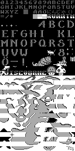
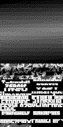

# nes-quantum-disassembly

An unofficial disassembly of the Nintendo Entertainment System (NES) demo *Quantum Disco Brothers* by wAMMA. Assembles with [ASM6](https://github.com/qalle2/asm6/).

## Table of contents

* [Notes](#notes)
* [How to get the original files](#how-to-get-the-original-files)
* [How to assemble](#how-to-assemble)
* [iNES ROM header info](#ines-rom-header-info)
* [The parts of the demo](#the-parts-of-the-demo)
* [Code/data log](#codedata-log)
* [CHR ROM banks](#chr-rom-banks)
* [References](#references)
* [Software used](#software-used)

## Notes

* This disassembly is at an early stage.
* I have not been involved with wAMMA or in the making of this demo.

## How to get the original files

1. Download the original *Quantum Disco Brothers* file from e.g. [pouet.net](https://www.pouet.net/prod.php?which=26485).
1. If the file is compressed, extract it to get an iNES ROM file (`quantum_disco_brothers_by_wAMMA.nes`, MD5 hash `2c932e9e8ae7859517905e2539565a89`).
1. Generate the CHR ROM data from `chr*.png` with *nes_chr_encode.py* from my [NES utilities](http://github.com/qalle2/nes-util); see `assemble.sh` for details.

## How to assemble

1. `asm6 quantum.asm "quantum-reassembled_(e).nes"` (the `(e)` in the filename tells FCEUX to start the ROM in PAL mode)
1. Verify that the `.nes` file is identical to the original:
  * `diff -q quantum_disco_brothers_by_wAMMA.nes "quantum-reassembled_(e).nes"` (on Linux)
  * `fc /b quantum_disco_brothers_by_wAMMA.nes "quantum-reassembled_(e).nes"` (on Windows)

Note: the Linux script `assemble.sh` is intended for my personal use. Do not run it before reading it.

## iNES ROM header info

* mapper: CNROM (iNES mapper number 3)
* PRG ROM: 32 KiB (1 &times; 32 KiB)
* CHR ROM: 32 KiB (4 &times; 8 KiB)
* name table mirroring: horizontal
* no trainer
* no save RAM

## The parts of the demo

* Screenshots from FCEUX in PAL mode.
* Frame numbers: FCEUX's Frame Display in PAL mode.
* The internal part numbers are at RAM address `0x0001`.


1st part (internally part 0, starts at frame ~6): "GREETINGS! WE COME FROM..."; uses CHR bank 0


2nd part (internally part 2, starts at frame 1156): "wAMMA - QUANTUM DISCO BROTHERS"; uses CHR bank 0


3rd part (internally part 11, starts at frame 1923): red&purple gradients; uses CHR bank 1


4th part (internally part 1, starts at frame 2690): horizontal color bars; uses CHR bank 1


5th part (internally part 4, starts at frame 3458): a woman; uses CHR bank 3


6th part (internally part 5, starts at frame 4481): "IT IS FRIDAY..."; uses CHR bank 0


7th part (internally part 7, starts at frame 6362): Coca Cola cans; uses CHR bank 2


8th part (internally part 6, starts at frame 7304): Bowser's spaceship; uses CHR bank 2


9th part (internally part 3, starts at frame 8071): credits; uses CHR bank 1


10th part (internally part 10, starts at frame 9692): a checkered wavy animation; uses CHR bank 1


11th part (internally part 12, starts at frame 10380): "GREETS TO ALL NINTENDAWGS"; uses CHR bank 2


12th part (internally part 13, starts at frame 11298): "GAME OVER - CONTINUE?"; uses CHR bank 2


13th part (internally part 9, starts at frame 14018): more horizontal color bars; uses CHR bank 2

The demo should probably end at this point, as on [this YouTube video](https://www.youtube.com/watch?v=hhoa_K75BKI).
However, on FCEUX, it starts to glitch from frame ~17603 on.
I omitted the glitchy part from the code/data log file.

## Code/data log

I created a code/data log file (`.cdl`) of the ROM using the Code/Data Logger in FCEUX.
The file is in `quantum.cdl.gz` (gz compressed).

I also converted the CDL file into a human-readable format using my [cdl-summary](http://github.com/qalle2/cdl-summary):
* `python3 cdl_summary.py --prg-size 32 --part p --bank-size 32 quantum.cdl > cdl-summary-raw-prg.csv`
* `python3 cdl_summary.py --prg-size 32 --part c --bank-size 8 quantum.cdl > cdl-summary-raw-chr.csv`

### PRG ROM

Below is the manually-edited PRG CDL data. Columns: CPU start address in hexadecimal, length in hexadecimal, description.

```
8000 (  34): unaccessed
8034 ( 123): code
8157 (   2): unaccessed
8159 (   4): code
815d (   2): unaccessed
815f (  6c): code
81cb (   2): unaccessed
81cd (  6e): code
823b (   d): unaccessed
8248 (  22): code
826a (   d): unaccessed
8277 (  10): code
8287 (   2): unaccessed
8289 (   6): code
828f (  42): unaccessed
82d1 (  bd): code
838e (  25): unaccessed
83b3 (  61): code
8414 (   3): unaccessed
8417 (  1c): code
8433 (   3): unaccessed
8436 (  42): code
8478 (   3): unaccessed
847b (  1a): code
8495 (   1): unaccessed
8496 (  62): code
84f8 (  15): unaccessed
850d (  41): code
854e (   d): unaccessed
855b (   3): code
855e (  53): unaccessed
85b1 (  7c): code
862d (  25): unaccessed
8652 (  2f): code
8681 (  21): unaccessed
86a2 (  f6): code
8798 (   2): unaccessed
879a ( 16c): code
8906 (  1b): unaccessed
8921 (   4): code
8925 (   b): unaccessed
8930 (   3): code
8933 (   1): unaccessed
8934 (   5): code
8939 (   2): unaccessed
893b (   f): code

894a (  11): unaccessed
895b (  10): data
896b (   1): unaccessed
896c (   8): data
8974 (   1): unaccessed
8975 (   7): data
897c (   1): unaccessed
897d (   9): data
8986 (   1): unaccessed
8987 (   1): data
8988 (   f): unaccessed
8997 (   1): data
8998 (   f): unaccessed
89a7 (   1): data
89a8 (   f): unaccessed
89b7 (   1): data
89b8 (   f): unaccessed
89c7 (   1): data
89c8 (   f): unaccessed
89d7 (   1): data
89d8 (   f): unaccessed
89e7 (   1): data
89e8 (   f): unaccessed
89f7 (   1): data
89f8 (   f): unaccessed
8a07 (   1): data
8a08 (   f): unaccessed
8a17 (   1): data
8a18 (   1): unaccessed
8a19 (   1): data
8a1a (   d): unaccessed
8a27 (   1): data
8a28 (   f): unaccessed
8a37 (   1): data
8a38 (   f): unaccessed
8a47 (   1): data
8a48 (   f): unaccessed
8a57 (   1): data
8a58 (   e): unaccessed
8a66 (   2): data
8a68 (   f): unaccessed
8a77 (   1): data
8a78 (  11): unaccessed
8a89 (   1): data
8a8a (   2): unaccessed
8a8c (   2): data
8a8e (   2): unaccessed
8a90 (   3): data
8a93 (   1): unaccessed
8a94 (   4): data
8a98 (   1): unaccessed
8a99 (   d): data
8aa6 (   1): unaccessed
8aa7 (   2): data
8aa9 (   1): unaccessed
8aaa (   1): data
8aab (   1): unaccessed
8aac (   b): data
8ab7 (   1): unaccessed
8ab8 (   6): data
8abe (   1): unaccessed
8abf (   4): data
8ac3 (   1): unaccessed
8ac4 (   1): data
8ac5 (   2): unaccessed
8ac7 (   1): data
8ac8 (  21): unaccessed
8ae9 (   1): data
8aea (   2): unaccessed
8aec (   2): data
8aee (   2): unaccessed
8af0 (   3): data
8af3 (   1): unaccessed
8af4 (   4): data
8af8 (   1): unaccessed
8af9 (   d): data
8b06 (   1): unaccessed
8b07 (   2): data
8b09 (   1): unaccessed
8b0a (   1): data
8b0b (   1): unaccessed
8b0c (   b): data
8b17 (   1): unaccessed
8b18 (   6): data
8b1e (   1): unaccessed
8b1f (   4): data
8b23 (   1): unaccessed
8b24 (   1): data
8b25 (   2): unaccessed
8b27 (   1): data
8b28 (  1e): unaccessed
8b46 (   2): data
8b48 (  23): unaccessed
8b6b (   2): data (indirectly accessed)
8b6d (   2): unaccessed
8b6f (   6): data (indirectly accessed)
8b75 (   3): unaccessed
8b78 (  38): data (indirectly accessed)
8bb0 (   8): unaccessed
8bb8 (  30): data (indirectly accessed)
8be8 (  10): unaccessed
8bf8 (   3): data (indirectly accessed)
8bfb (   1): unaccessed
8bfc (   3): data (indirectly accessed)
8bff (   1): unaccessed
8c00 (   3): data (indirectly accessed)
8c03 (   1): unaccessed
8c04 (   3): data (indirectly accessed)
8c07 (   1): unaccessed
8c08 (   3): data (indirectly accessed)
8c0b (   1): unaccessed
8c0c (   3): data (indirectly accessed)
8c0f (   1): unaccessed
8c10 (   3): data (indirectly accessed)
8c13 (   1): unaccessed
8c14 (   3): data (indirectly accessed)
8c17 (   1): unaccessed
8c18 (   3): data (indirectly accessed)
8c1b (   1): unaccessed
8c1c (   3): data (indirectly accessed)
8c1f (   1): unaccessed
8c20 (   3): data (indirectly accessed)
8c23 (   1): unaccessed
8c24 (   3): data (indirectly accessed)
8c27 (   1): unaccessed
8c28 (   3): data (indirectly accessed)
8c2b (   1): unaccessed
8c2c (   3): data (indirectly accessed)
8c2f (   1): unaccessed
8c30 (   3): data (indirectly accessed)
8c33 (   1): unaccessed
8c34 (   3): data (indirectly accessed)
8c37 (   1): unaccessed
8c38 (   3): data (indirectly accessed)
8c3b (   1): unaccessed
8c3c (   3): data (indirectly accessed)
8c3f (   1): unaccessed
8c40 (   3): data (indirectly accessed)
8c43 (   1): unaccessed
8c44 (   3): data (indirectly accessed)
8c47 (   1): unaccessed
8c48 (   3): data (indirectly accessed)
8c4b (   1): unaccessed
8c4c (   3): data (indirectly accessed)
8c4f (   1): unaccessed
8c50 (   3): data (indirectly accessed)
8c53 (   1): unaccessed
8c54 (   3): data (indirectly accessed)
8c57 (   1): unaccessed
8c58 (   3): data (indirectly accessed)
8c5b (   1): unaccessed
8c5c (   3): data (indirectly accessed)
8c5f (   1): unaccessed
8c60 (   3): data (indirectly accessed)
8c63 (   1): unaccessed
8c64 (   3): data (indirectly accessed)
8c67 (   1): unaccessed
8c68 (   3): data (indirectly accessed)
8c6b (   1): unaccessed
8c6c (   3): data (indirectly accessed)
8c6f (   1): unaccessed
8c70 (   3): data (indirectly accessed)
8c73 (   1): unaccessed
8c74 (   3): data (indirectly accessed)
8c77 (   1): unaccessed
8c78 (   3): data (indirectly accessed)
8c7b (   1): unaccessed
8c7c (   3): data (indirectly accessed)
8c7f (   1): unaccessed
8c80 (   3): data (indirectly accessed)
8c83 (   1): unaccessed
8c84 (   3): data (indirectly accessed)
8c87 (   1): unaccessed
8c88 (   3): data (indirectly accessed)
8c8b (   1): unaccessed
8c8c (   3): data (indirectly accessed)
8c8f (   1): unaccessed
8c90 (   3): data (indirectly accessed)
8c93 (   1): unaccessed
8c94 (   3): data (indirectly accessed)
8c97 (   1): unaccessed
8c98 (   3): data (indirectly accessed)
8c9b (   1): unaccessed
8c9c (   3): data (indirectly accessed)
8c9f (   1): unaccessed
8ca0 (   3): data (indirectly accessed)
8ca3 (   1): unaccessed
8ca4 (   3): data (indirectly accessed)
8ca7 (   1): unaccessed
8ca8 (   3): data (indirectly accessed)
8cab (   1): unaccessed
8cac (   3): data (indirectly accessed)
8caf (   1): unaccessed
8cb0 (   3): data (indirectly accessed)
8cb3 (   1): unaccessed
8cb4 (   3): data (indirectly accessed)
8cb7 (   1): unaccessed
8cb8 (   3): data (indirectly accessed)
8cbb (   1): unaccessed
8cbc (   3): data (indirectly accessed)
8cbf (   1): unaccessed
8cc0 (   3): data (indirectly accessed)
8cc3 (   1): unaccessed
8cc4 (   3): data (indirectly accessed)
8cc7 (   1): unaccessed
8cc8 (   3): data (indirectly accessed)
8ccb (   1): unaccessed
8ccc (   3): data (indirectly accessed)
8ccf (   1): unaccessed
8cd0 (   3): data (indirectly accessed)
8cd3 (   1): unaccessed
8cd4 (   3): data (indirectly accessed)
8cd7 (   1): unaccessed
8cd8 (   3): data (indirectly accessed)
8cdb (   1): unaccessed
8cdc (   3): data (indirectly accessed)
8cdf (   1): unaccessed
8ce0 (   3): data (indirectly accessed)
8ce3 (   5): unaccessed
8ce8 (   2): data (indirectly accessed)
8cea (   2): unaccessed
8cec (  38): data (indirectly accessed)
8d24 (   8): unaccessed
8d2c (   8): data (indirectly accessed)
8d34 (   2): unaccessed
8d36 (  3c): data (indirectly accessed)
8d72 (   2): unaccessed
8d74 (  4c): data (indirectly accessed)
8dc0 (  53): unaccessed
8e13 (127a): data (indirectly accessed)
a08d (1f73): unaccessed

c000 (  a8): code

c0a8 (   e): data
c0b6 (   2): unaccessed
c0b8 (  70): data (indirectly accessed)
c128 (  10): unaccessed
c138 ( 116): data
c24e (   6): unaccessed
c254 (  20): data
c274 (   c): unaccessed
c280 ( fa1): data (PCM audio)
d221 (   4): unaccessed
d225 ( 2e9): data
d50e (   2): unaccessed
d510 (   5): data
d515 (   1): unaccessed
d516 (   4): data
d51a (   1): unaccessed
d51b (   1): data
d51c (   3): unaccessed
d51f (   1): data
d520 (   2): unaccessed
d522 (   2): data
d524 (   c): unaccessed
d530 ( 50d): data
da3d (  48): unaccessed
da85 (  65): data
daea (  31): unaccessed
db1b (   d): data
db28 (   2): unaccessed
db2a (  78): data
dba2 (   f): unaccessed
dbb1 (   4): data
dbb5 (  1a): unaccessed
dbcf (  4d): data
dc1c (   5): unaccessed
dc21 (   b): data
dc2c (   5): unaccessed
dc31 (   b): data
dc3c (   5): unaccessed
dc41 (   b): data
dc4c (   6): unaccessed
dc52 (  40): data
dc92 (   4): unaccessed

dc96 (  14): code
dcaa (  25): unaccessed
dccf (  53): code
dd22 (  2d): unaccessed
dd4f ( 251): code
dfa0 (   1): code, data
dfa1 (  72): code
e013 (   3): unaccessed
e016 (  bd): code
e0d3 (  d2): unaccessed
e1a5 (  b8): code
e25d (   1): code, data
e25e ( 214): code
e472 (   1): code, data
e473 ( 164): code
e5d7 (   1): code, data
e5d8 ( 4a7): code
ea7f (   1): code, data
ea80 ( 1c7): code
ec47 (   1): code, data
ec48 (  51): code
ec99 ( 262): unaccessed
eefb ( 195): code
f090 (   1): code, data
f091 (  80): code
f111 (   5): unaccessed
f116 ( 176): code
f28c (   1): code, data
f28d ( 1be): code
f44b (   1): code, data
f44c (  ad): code
f4f9 (   b): unaccessed
f504 ( 17c): code
f680 (   1): code, data
f681 ( 14f): code
f7d0 (  2d): unaccessed
f7fd ( 183): code
f980 (   3): unaccessed
f983 (  30): code
f9b3 (   4): unaccessed
f9b7 ( 17e): code
fb35 (   8): unaccessed
fb3d (  e9): code
fc26 ( 3d4): unaccessed

fffa (   4): data (NMI and reset vectors)
fffe (   2): unaccessed (IRQ vector)
```

### CHR ROM

No CHR data was read programmatically via `$2007`. See also the chapter "CHR ROM banks" below.

## CHR ROM banks

See also the chapter "Code/data log" above.

### Bank 0


Used by the 1st, 2nd and 6th part of the demo.

Tiles rendered (completely or partially; in hexadecimal):
* first half: `00, 0a-19, 1b-20, 22, 24-25, 2a-2f, 37-3f, 48-4f, 58-69, 6e-79, 7e-87, 8a-97, 9a-a1, a4-a5, ac-b1, b4-b5, bc-bf, c2-c6, c9-cf, d2-e5, ea-ff`
* second half: `00-ff`


An unused cat in the first half. Colored by me.

### Bank 1


Used by the 3rd, 4th, 9th and 10th part of the demo.

Tiles rendered (completely or partially; in hexadecimal):
* first half: `00-17, 19-1a, 1c-2f, 31-84, c4-d1, d3-d4, d6-da, dc, de-e4, e6, e8-e9, eb, ed, ef-f0, f2-ff`
* second half: `00-b3, c0-cf, e0-f7`

### Bank 2


Used by the 7th, 8th, 11th, 12th and 13th part of the demo.

Tiles rendered (completely or partially; in hexadecimal):
* first half: `00, 09-0f, 19-1e, 29-2f, 3e-43, 50-53, 60-ff`
* second half: `00-4e, 50, 7a-7e, 80-ff`


Three unused ninja animation frames in the first half. Colored by me.


Same as above but animated at 5 fps in order 1, 2, 3, 2.


An unused small crescent moon in the first half. Here, colored the same as the big crescent moon used in the 8th part of the demo.


Unused big asteroids (fireballs?) in the first half. Here, colored the same as the small asteroids/fireballs used in the 8th part of the demo.


Unused eyes of a ninja in the second half. Colored by me.

### Bank 3


Used by the 5th part of the demo.

Tiles rendered (completely or partially; in hexadecimal):
* first half: `00-ff`
* second half: `00-d9, df-e4, ef-ff`

## References

* [NESDev Wiki](http://wiki.nesdev.com):
  * [APU registers](http://wiki.nesdev.com/w/index.php/APU_registers)
  * [CNROM](http://wiki.nesdev.com/w/index.php/CNROM)
  * [iNES](http://wiki.nesdev.com/w/index.php/INES) file format
  * [PPU registers](http://wiki.nesdev.com/w/index.php/PPU_registers)
* [a 6502 instruction reference](http://www.obelisk.me.uk/6502/reference.html)

## Software used

* FCEUX (Code/Data Logger etc.)
* HxD (hex editor)
* my [cdl-summary](http://github.com/qalle2/cdl-summary)
* my [NES utilities](http://github.com/qalle2/nes-util)
